# Architecture and partner roles

## Local mode

```
Browser ──▶ modern.server (127.0.0.1) ──▶ App router ──▶ PaymentService ──▶ SqliteStore (data/modern.sqlite)
                                                 │               ▲
                                                 ▼               │ signed webhooks (HMAC)
                                        SimulatedProvider ───────┘
```

## AWS mode (deployed and exercised)

```mermaid
flowchart LR
  Op[Operator laptop<br/>modern.server / modern.demo<br/>SigV4 signing with operator's profile] -->|HTTPS + SigV4| APIGW[API Gateway HTTP API<br/>route ANY /api/&#123;proxy+&#125;<br/>AuthorizationType AWS_IAM, throttled]
  APIGW --> L[Lambda python3.13 arm64<br/>modern.lambda_handler]
  L -->|TransactWriteItems / GetItem / Query<br/>LeadingKeys NS#demo-*| DDB[(Foundation DynamoDB table<br/>on-demand, SSE)]
  L -->|GetSecretValue once per cold start| SM[Secrets Manager<br/>simulator HMAC key]
  L --> CW[CloudWatch Logs<br/>7-day retention, no bodies]
  S3[(Foundation artifacts bucket<br/>Lambda zip)] -.deploy.-> L
  subgraph Simulated provider inside Lambda
    SIM[SimulatedProvider<br/>provider-side idempotency, signed events]
  end
  L --- SIM
```



- There is no VPC, NAT gateway, always-on database, container or Kubernetes. All compute is
  per request.
- The application stack (`infra/app.json`) sits on top of the existing foundation stack
  (`infra/foundation.json`, unchanged). Deleting the app stack leaves the foundation intact.
- The provider sits behind the `PaymentProvider` protocol (`submit`, `lookup`) and a
  signed-event contract. A real core or payment provider adapter would replace
  `SimulatedProvider` and its webhook verifier; the service and ledger code would not change.

## Partner roles in a real engagement

| Partner | Role in this integration |
| --- | --- |
| **Bank** | Owns the customer relationship, the general ledger, risk appetite and regulatory accountability. Approves the ledger semantics, the reconciliation tolerances, and the cutover from the batch. Operates the AWS account. |
| **Implementation consultancy** | Runs the program: maps legacy batch behavior to event semantics, builds the operating model (exception queues, reconciliation sign-off), drives testing and cutover, and integrates with the bank's controls. |
| **Core provider** (e.g. a modern banking core or payment platform) | Holds the system of record for accounts and payment rails. Exposes the payment API, idempotency guarantees, and signed settlement and return events. Its documented contract determines the adapter. *This demo uses a simulator. No real core provider integration is claimed.* |
| **Cognition (Devin)** | Accelerates the engineering: reads the legacy code, builds the adapter, idempotency and ledger logic, writes the behavioral and race tests, the infrastructure-as-code and runbooks, and opens reviewable PRs. It works only through scoped access the bank grants; it does not hold production credentials. |
| **AWS** | Provides the managed serverless runtime: API Gateway with IAM auth, Lambda, DynamoDB transactions, Secrets Manager and CloudWatch. These give per-request scaling with no servers to run, and auditable IAM boundaries. |
